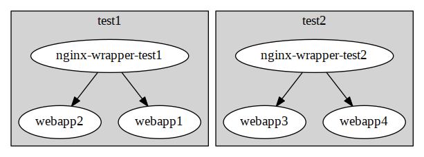

disnix-virtualhosts-example
===========================
This is an example deploying a collection web applications and a reverse proxy
that support multiple virtual hosts. The purpose of this example is to
demonstrate how we can dynamically create target-specific services and deploy
them to the corresponding machines with Disnix.

Architecture
============


With this example you can automatically set up deployments as shown in the figure
above. We have two kinds of services:

* Web applications returning their virtual host name (their names are prefixed
  with `webapp`)
* An nginx reverse proxy per machine forwarding requests to the web applications
  that are deployed to the machine

In general, services in Disnix are independendent units of deployment that have
the same structure regardless to which machines they are deployed in the network.

In some cases, however, it may also be desirable to define services that are
configured for a specific target machines.

In this example, the reverse proxies are services having a *target-specific*
configuration -- their configurations are specifically optimised for the machine
to which they have been deployed. For example, the `nginx` reverse proxy on
machine `test1` only knows about the web application that have been deployed to
it.

The advantage of deploying target-specific components is that they will prevent
expensive redeployments in case of an upgrade. For example, if a change has been
to `test2`'s configuration, then `test1` should not be affected.

Prerequisites
=============
To deploy this example system, you need a checkout of the
[Nix process management framework](https://github.com/svanderburg) in the same
base directory.

Usage
=====
The `deployment/DistributedDeployment` sub folder contains all neccessary Disnix
models, such as a services, infrastructure and distribution models required for
deployment.

Deployment using Disnix in a heterogeneous network
--------------------------------------------------
For this scenario only installation of the basic Disnix toolset is required.
First, you must manually install a network of machines running the Disnix service.
Then you must adapt the infrastructure model to match to properties of your
network and the distribution model to map the services to the right machines.

The system can be deployed by running the following command:

```bash
$ disnix-env -s services.nix -i infrastructure.nix -d distribution.nix
```

Deployment using the NixOS test driver
--------------------------------------
This system can be deployed without adapting any of the models in
`deployment/DistributedDeployment`. By running the following instruction, the
variant without the proxy can be deployed in a network of virtual machines:

```bash
$ disnixos-vm-env -s services.nix -n network.nix -d distribution.nix
```

Deployment using NixOps for infrastructure and Disnix for service deployment
----------------------------------------------------------------------------
It's also possible to use NixOps for deploying the infrastructure (machines) and
let Disnix do the deployment of the services to these machines.

A virtualbox network can be deployed as follows:

```bash
$ nixops create ./network.nix ./network-virtualbox.nix -d vboxtest
$ nixops deploy -d vboxtest
```

The services can be deployed by running the following commands:

```bash
$ export NIXOPS_DEPLOYMENT=vboxtest
$ disnixos-env -s services.nix -n network.nix -d distribution.nix --use-nixops
```

Running the system
==================
After the system has been deployed, open a terminal on the third machine and
run:

```bash
$ curl -H 'Host: webapp2.local' http://test1
```

Subsitute `webapp2.local` with the desired virtual hostname.

What you will also notice is that if you request a non-existent web application
on a specific-machine, it will return an error page:

```bash
$ curl -H 'Host: nonexistent.local' http://test1
```

A more advanced use case
========================
The previously described use cases only deploy two reverse proxies and four web
application instances attached to them.

We can also do the same thing on a large scale by *dynamically* composing as
many web application variants as we want and dynamically map them to machines
with reverse proxies.

Edit `services-dynamic.nix` and change the line:

```nix
let
  ...
  numbers = pkgs.lib.range 1 4;
in
```

into a desired range. For example, to deploy 20 instances of the webapp, we
can change it into:

```nix
let
  ...
  numbers = pkgs.lib.range 1 20;
in
```

We can use the `dydisnix-gendist` tool from the
[Dynamic Disnix](https://github.com/svanderburg/dydisnix) toolset to generate a
distribution model that map our 20 services to the machines in the
infrastructure model:

```bash
$ distribution=$(dydisnix-gendist -s services-dynamic.nix -i infrastructure.nix -q qos.nix)
```

The above command-line instruction uses a QoS model that distributes the
services to each target in the distribution model using a greedy strategy. In
the infrastructure model, each target states that it has a capacity of hosting
10 services:

```nix
{
  test1 = {
    properties = {
      capacity = 10;
      ...
    };
  };
  ...
}
```

After generating the distribution model, we must assign unique TCP port numbers
to each service so that they can be properly reached. We can automatically
assign them by running:

```bash
$ dydisnix-id-assign -s services-dynamic.nix -i infrastructure.nix -d $distribution --id-resources idresources.nix --ids ids.nix --output-file ids.nix
```

Finally, we can deploy the dynamically composed configuration:

```bash
$ disnix-env -s services-dynamic.nix -i infrastructure.nix -d $distribution
```

After the above command succeeds, we have two machines each hosting 10 web
applications with reverse proxies in front of them.

License
=======
This package is released under the [MIT license](http://opensource.org/licenses/MIT).
